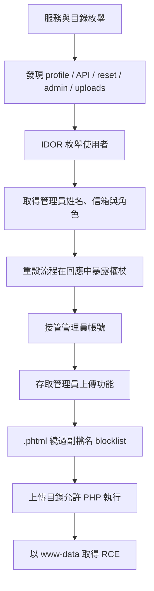

# RecruitX Web 應用程式滲透測試筆記

> **用途與授權聲明**：本文整理自受控靶場 RecruitX 的教學流程，只適用於自己擁有、CTF／靶場或已取得書面授權的系統。請勿把文中的測試方式用於未授權目標。

## 1. 學習目標與整體思路

這個案例展示的不是單一「神奇漏洞」，而是一條完整的攻擊鏈：

1. **偵察與枚舉（Reconnaissance & Enumeration）**：辨識服務、技術棧、頁面與 API。
2. **不安全直接物件參照（IDOR）**：修改可預測的物件 ID，讀取其他使用者資料。
3. **弱密碼重設流程**：從回應取得重設權杖，接管管理員帳號。
4. **管理後台存取**：利用已取得的管理員身分進入檔案上傳功能。
5. **遠端程式碼執行（RCE）**：繞過副檔名封鎖，上傳可由伺服器執行的 PHP 檔案。

核心觀念是 **漏洞串接（vulnerability chaining）**：資訊洩露本身未必能取得系統權限；但它洩露的管理員信箱可用來濫用密碼重設，而接管帳號後又能觸及有缺陷的上傳介面，最終形成完整入侵路徑。

---

## 2. 前置知識

### 2.1 Linux CLI

- `curl`：發送 HTTP 請求、檢視標頭與回應內容。
- `grep`：從大量 HTML 或文字輸出中篩選關鍵資料。
- `nc`（Netcat）：在受控測試中建立 TCP 監聽器。
- Shell 的重新導向與管線：例如 `>` 建立檔案、`|` 串接指令。

### 2.2 HTTP 基礎

測試時要分清：

- **URL 路徑**：例如 `/profile.php`、`/api/user`。
- **查詢參數**：例如 `?id=1`，通常代表伺服器要操作的物件。
- **Cookie**：如 PHP 常見的 `PHPSESSID`，用來識別登入工作階段。
- **狀態碼**：`200` 表示成功，`301` 表示重新導向，`403` 表示拒絕，`404` 表示找不到。
- **回應標頭**：`Server`、`X-Powered-By` 等欄位可能洩露技術與版本資訊。

### 2.3 Web 應用程式基礎

要理解瀏覽器端與伺服器端的信任邊界：HTML 的 `accept`、JavaScript 驗證等都能被使用者修改，不能當成安全控制；真正的授權、輸入驗證及檔案檢查必須在伺服器端執行。

---

## 3. 階段一：偵察與枚舉

### 3.1 連接目標

靶場應用程式位於：

```text
http://MACHINE_IP:80
```

`MACHINE_IP` 是平台配置的目標位址。實務上先確認測試範圍、允許的來源 IP、時段及禁止事項，再開始掃描。

### 3.2 Nmap 服務掃描

```bash
nmap -sV -sC -p- MACHINE_IP
```

參數說明：

| 參數 | 作用 | 測試價值 |
|---|---|---|
| `-sV` | 探測服務與版本 | 找出 Apache、OpenSSH、MySQL 等元件及版本 |
| `-sC` | 執行預設 NSE 腳本 | 收集標頭、服務資訊與常見設定 |
| `-p-` | 掃描全部 65,535 個 TCP port | 避免只掃常用埠而漏掉服務 |

案例觀察：

- `22/tcp`：OpenSSH，代表伺服器提供 SSH，但此階段沒有憑證。
- `80/tcp`：Apache HTTP Server，主 Web 應用程式入口。
- `3306/tcp`：MySQL，表示後端可能使用資料庫。
- HTTP 標頭與頁尾顯示 Apache、PHP 等資訊，可推測為典型 **LAMP**（Linux、Apache、MySQL、PHP）技術棧。

> 版本資訊是「線索」而不是漏洞證明。不能只看版本字串就宣稱存在 CVE；還要考慮發行版是否回補修補程式，並以安全的方式驗證。

### 3.3 檢查 HTTP 標頭

```bash
curl -I http://MACHINE_IP
```

`-I` 只取得回應標頭。可關注 `Server`、`Set-Cookie`、`Content-Type`、快取政策與安全標頭。案例中可由 `Server: Apache/...` 與 `X-Powered-By: PHP/...` 進一步確認技術棧；正式系統應盡量減少不必要的版本揭露。

### 3.4 目錄與檔案枚舉

```bash
gobuster dir \
  -u http://MACHINE_IP \
  -w /usr/share/wordlists/dirbuster/directory-list-2.3-small.txt \
  -x php
```

- `dir`：使用目錄枚舉模式。
- `-u`：指定目標基底 URL。
- `-w`：指定字典；工具會逐一測試可能的名稱。
- `-x php`：同時測試 PHP 副檔名。

重要發現與意義：

| 路徑 | 意義 |
|---|---|
| `/admin` | 管理介面；未登入時重新導向不代表路徑無用，之後取得高權限帳號可再訪問 |
| `/api` | API 入口，可能回傳比頁面更多的結構化資料 |
| `/reset.php` | 密碼重設流程，是帳號接管的重要攻擊面 |
| `/profile.php` | 使用者資料頁，需留意是否以 ID 直接選取資料 |
| `/uploads` | 上傳內容存放處；若位於 Web root 且可執行腳本，風險極高 |
| `/config` | 可能包含設定或敏感資訊，需確認是否可公開存取 |

狀態碼也很重要：`301` 通常表示路徑存在但被重新導向；`403` 代表資源存在但目前遭拒；不同回應大小亦可能透露內容差異。

### 3.5 建立一般使用者並觀察功能

使用靶場提供的測試帳號登入後，應先正常操作每項功能，建立「正常行為基準」：

- 儀表板顯示職缺與申請數。
- 使用者名稱連到個人資料頁。
- 可檢視職缺並送出申請。
- 角色顯示為 `candidate`。

滲透測試不只是使用掃描器；先了解正常流程，才能判斷參數、權限與回應是否異常。

### 3.6 API 探索

```bash
curl http://MACHINE_IP/api/
```

案例 API 索引公開列出端點，例如：

```json
{"endpoints":["/api/user","/api/jobs","/api/applications"]}
```

這是 **端點資訊洩露**。API 文件或索引不一定必然有漏洞，但未驗證身分的使用者不應取得內部路由清單；每個列出的端點仍須獨立測試身分驗證、授權、輸入驗證與資料最小化。

### 3.7 本階段答案

- Apache 版本：`2.4.58`
- 資料庫服務：`MySQL`
- 密碼重設路徑：`/reset.php`

---

## 4. 階段二：IDOR（不安全直接物件參照）

### 4.1 什麼是 IDOR

IDOR 屬於物件層級授權失敗。應用程式接受使用者可控的識別碼，例如：

```text
/profile.php?id=6
/api/user?id=1
```

問題不在於使用數字 ID 本身，而在於後端查到物件後，**沒有確認目前登入者是否有權讀取或修改該物件**。即使改用 UUID，若沒有授權檢查，也只是增加猜測難度，沒有修復根因。

### 4.2 辨認可疑物件參照

一般帳號的個人頁 URL 為：

```text
http://MACHINE_IP/profile.php?id=6
```

`id=6` 顯然是使用者物件識別碼。測試者應在代理工具或瀏覽器中把它改成自己無權存取的 ID，並比較狀態碼、頁面內容、資料欄位與錯誤訊息。

### 4.3 驗證 Web 頁面的 IDOR

取得自己合法登入工作階段的 `PHPSESSID` 後：

```bash
curl -s \
  -b 'PHPSESSID=<YOUR_SESSION_COOKIE>' \
  'http://MACHINE_IP/profile.php?id=1'
```

- `-s`：靜默模式，隱藏進度列。
- `-b`：在請求中帶入 Cookie。
- Cookie 是敏感憑證，不應寫入共享終端歷史、報告或原始碼。

若一般使用者把 `id` 從自己的 `6` 改為 `1` 後看見 Sarah Mitchell 的管理員資料，就證明後端只有驗證「是否登入」，卻沒有驗證「能否存取使用者 1」。

### 4.4 API 的未授權 IDOR

```bash
curl -s 'http://MACHINE_IP/api/user?id=1'
curl -s 'http://MACHINE_IP/api/user?id=2'
```

案例中 API 甚至不要求 Session，並回傳姓名、電子郵件、角色與建立日期。逐號遞增 ID 還能枚舉使用者，結合了：

1. **缺少身分驗證**：未登入即可請求。
2. **缺少物件層級授權**：可指定任意使用者 ID。
3. **可預測識別碼**：連續整數讓批次枚舉更容易。
4. **過度資料暴露**：回傳後續攻擊所需的管理員信箱與角色。

### 4.5 影響與修復

可能影響包括個資外洩、使用者枚舉、針對高權限帳號的社交工程，以及為後續帳號接管提供資料。

正確修復方式：

- 每次讀、改、刪物件時，在伺服器端執行物件層級授權。
- 查詢資料時同時限制擁有者，例如以「物件 ID + 目前使用者 ID」作為條件。
- 採預設拒絕（deny by default）原則，並對管理員例外權限明確建模。
- API 只回傳功能真正需要的欄位。
- UUID 可作縱深防禦，但不可取代授權。
- 自動化測試應涵蓋「使用者 A 不得存取使用者 B 的物件」。

### 4.6 本階段答案

- 管理員姓名：`Sarah Mitchell`
- James Crawford 的角色：`hiring_manager`

---

## 5. 階段三：弱密碼重設流程

### 5.1 安全重設流程應有的性質

合理流程通常是：使用者提交信箱 → 系統一律顯示相同的中性訊息 → 透過已驗證的私密通道寄出一次性權杖 → 使用者持權杖設定新密碼。

權杖應：

- 由密碼學安全亂數產生器產生，具足夠熵值。
- 僅能使用一次，成功重設後立即失效。
- 有短效期限，並綁定特定帳號與用途。
- 在資料庫中以雜湊形式保存。
- 不出現在頁面、一般日誌、分析平台或 `Referer` 中。
- 有合理的請求頻率限制與異常監控。

### 5.2 案例中的三個缺陷

1. **權杖直接顯示在 HTTP 回應**：任何能提交管理員信箱的人都能取得權杖，完全繞過「信箱所有權」驗證。
2. **權杖空間過小**：固定 6 位數只有 1,000,000 種組合（`000000` 到 `999999`），不足以抵抗線上猜測。
3. **缺少頻率限制**：未限制重設請求或權杖驗證次數，使暴力嘗試更可行。

其中第一點已足以導致接管，不需要暴力破解：從 IDOR 得知 `s.mitchell@recruitx.thm`，提交該地址後，應用程式就把有效權杖直接交給請求者。

### 5.3 漏洞串接

```text
IDOR 洩露管理員信箱
        ↓
重設頁為該信箱建立並公開權杖
        ↓
使用權杖設定新密碼
        ↓
以 Sarah Mitchell／Administrator 身分登入
```

這解釋了為何風險評估不能只逐項看漏洞：IDOR 的機密性影響與弱重設流程的身分驗證失敗相互放大，結果是完整帳號接管。

### 5.4 修復建議

- 不論信箱是否存在，都回覆相同訊息與近似回應時間，降低帳號枚舉。
- 權杖只透過帳號已驗證的信箱傳送，絕不回傳給網頁呼叫端。
- 使用至少 128 bits 的密碼學安全隨機值。
- 設定短效期限、單次使用及重新簽發即撤銷舊權杖。
- 對帳號、IP、裝置與全域流量分層限速。
- 成功重設後撤銷既有 Session，並通知帳號所有者。
- 在不記錄原始權杖的前提下保留安全稽核紀錄。

### 5.5 本階段答案

- 重設權杖長度：`6` 位數
- 重設並登入後顯示角色：`Administrator`

---

## 6. 階段四：管理後台與檔案上傳

### 6.1 為何上傳功能是高風險面

管理後台的 `/admin/upload.php` 接受 PDF、DOCX、JPG、PNG 等公司文件，並說明檔案保存於 `/uploads/documents/`。上傳同時具備以下條件時，可能變成程式碼執行：

1. 攻擊者能控制檔案內容或名稱。
2. 檔案保存位置可從 Web 存取。
3. Web 伺服器把該檔案類型交給腳本引擎執行。

### 6.2 `accept` 不等於安全驗證

HTML 可能包含：

```html
<input type="file" accept=".pdf,.docx,.jpg,.png">
```

`accept` 只是在瀏覽器檔案選擇器中提供提示；使用者可以用開發者工具刪掉它，或完全繞過網頁自行送出 HTTP 請求。因此它改善的是使用體驗，不是安全邊界。

案例先移除 `accept` 並上傳 `.txt`，伺服器仍拒絕，表示後端確實另有副檔名檢查；然而「有後端檢查」不代表檢查正確。

### 6.3 Blocklist 的典型缺陷

伺服器拒絕 `.php`，但接受 Apache／PHP 可能同樣處理的替代副檔名 `.phtml`。這表示實作大概只封鎖已知危險名稱，而沒有定義真正允許的類型。

Blocklist 容易漏掉：

- 替代副檔名與大小寫變體。
- 多重副檔名、尾端字元或正規化差異。
- MIME type 與實際檔案內容不一致。
- Web 伺服器後續新增或變更的處理器映射。

### 6.4 安全的上傳設計

- 使用小而明確的 **allowlist**，只允許業務需要的格式。
- 同時驗證正規化後副檔名、伺服器端判斷的 MIME type、magic bytes 與檔案結構。
- 重新編碼圖片；對複雜文件可採隔離式內容消毒與惡意程式掃描。
- 使用伺服器產生的隨機檔名，避免路徑穿越、覆寫與危險字元。
- 設定檔案大小、數量、壓縮後展開大小與處理時間限制。
- **將檔案存於 Web root 外**；下載時由應用程式做授權後串流回傳。
- 若必須置於可公開目錄，應在 Web 伺服器層明確禁止腳本執行，並使用獨立網域與安全的 `Content-Disposition`。
- 上傳目錄採最小檔案系統權限，不讓 Web 程序寫入應用程式碼目錄。

### 6.5 本階段答案

- 處理上傳的 PHP 檔案：`upload.php`
- 用於限制檔案類型的 HTML 屬性：`accept`
- 繞過封鎖的替代 PHP 副檔名：`.phtml`

---

## 7. 階段五：遠端程式碼執行（RCE）

### 7.1 Web shell 的原理

在靶場中，上傳的 PHP 腳本從 URL 的 `cmd` 參數取得內容，再交給 `shell_exec()`：

```php
<?php
if (isset($_GET['cmd'])) {
    echo '<pre>' . shell_exec($_GET['cmd']) . '</pre>';
}
?>
```

當攻擊者能控制 `cmd`，資料流就是：

```text
HTTP 查詢參數 → PHP 程式 → shell_exec() → 作業系統 Shell
```

這是典型的命令注入／任意命令執行。`<pre>` 只負責保留輸出排版，沒有任何安全效果。

### 7.2 驗證執行身分與系統資訊

在已授權靶場可用低衝擊命令確認漏洞：

```bash
curl 'http://MACHINE_IP/uploads/documents/shell.phtml?cmd=whoami'
curl 'http://MACHINE_IP/uploads/documents/shell.phtml?cmd=id'
curl 'http://MACHINE_IP/uploads/documents/shell.phtml?cmd=hostname'
curl 'http://MACHINE_IP/uploads/documents/shell.phtml?cmd=uname+-a'
```

- `whoami`：顯示目前有效使用者，案例為 `www-data`。
- `id`：顯示 UID、GID 與群組，可判斷程序權限。
- `hostname`：辨識主機，案例答案為 `recruitx-prod`。
- `uname -a`：取得核心與平台資訊。

應先使用無破壞性的 proof-of-concept，收集足以證明風險的最少證據後停止。不要為了「證明更多」而修改、刪除或大量下載資料。

### 7.3 敏感檔案讀取的含義

Web 程序能讀取 `/etc/passwd`，表示 RCE 已跨越應用程式邊界，能以 `www-data` 的作業系統權限讀取本機資源。`/etc/passwd` 現代系統通常不保存密碼雜湊，但會揭露帳號、UID、家目錄與登入 Shell，可協助本機枚舉。

真正影響取決於程序權限與主機隔離：若設定檔、環境變數、雲端憑證或資料庫密碼對 `www-data` 可讀，可能導致資料庫、其他服務甚至雲端資源進一步失陷。

### 7.4 Web shell 與 Reverse shell 的差別

| 類型 | 特性 | 限制／風險 |
|---|---|---|
| Web shell | 每個命令是一個 HTTP 請求 | 無完整互動終端；特殊字元需 URL 編碼；容易留下 Web 日誌 |
| Reverse shell | 目標主動連回測試者的監聽器 | 需目標可向外連線；防火牆／EDR 可能攔截；操作影響更高 |

靶場用 `nc -lvnp 4444` 監聽，再透過 URL 編碼的 Bash payload 建立反向連線。`%26`、`%3E` 等編碼是為了避免 `&`、`>` 被 URL 或 Shell 提前解讀。實際委託中是否允許 reverse shell 必須由交戰規則明確授權。

### 7.5 RCE 防禦與事故處理

- 首要修復仍是安全的上傳架構：Web root 外保存、禁止執行、嚴格 allowlist。
- 讓 Web 服務以專用低權限帳號運作，限制檔案及網路權限。
- 使用容器／沙箱、唯讀檔案系統、MAC（AppArmor／SELinux）與出站網路限制。
- 避免將使用者輸入交給 Shell；需要啟動程序時使用固定參數介面並嚴格驗證。
- 發現已被利用時，不應只刪除上傳檔：須隔離主機、保存證據、輪替憑證、撤銷 Session、檢查持久化與橫向移動，並依事件回應流程重建可信環境。

### 7.6 本階段答案

- Web shell 執行使用者：`www-data`
- 目標主機名稱：`recruitx-prod`
- 靶場旗標：`THM{ch41n3d_vulns_4r3_d3v4st4t1ng}`

> 旗標只是靶場完成證據；真實報告應記錄可重現但最小化的技術證據、時間、請求／回應與影響，而非追求旗標。

---

## 8. 完整攻擊鏈與因果關係



這條鏈中可歸納為 **4 個被串接的主要漏洞**：

1. 使用者頁面與 API 的 IDOR／授權失敗。
2. 密碼重設權杖暴露及弱權杖控制。
3. 檔案上傳副檔名 blocklist 不完整。
4. 上傳內容位於可由 Web 伺服器執行的位置，導致 RCE。

枚舉是必要的測試階段，API 索引洩露則是額外發現；它們協助找到攻擊面，但在課程答案的計數方式中，串接的主要漏洞數為 `4`。

---

## 9. 漏洞摘要與修復優先序

| 發現 | 建議嚴重度 | 主要影響 | 核心修復 |
|---|---:|---|---|
| 使用者頁面及 API 的 IDOR | High | 個資與管理員資料洩露 | 每個請求做伺服器端物件層級授權 |
| 重設權杖顯示在回應 | Critical | 管理員帳號接管 | 僅經驗證私密通道傳送高熵、短效、單次權杖 |
| 不完整的檔案副檔名 blocklist | Critical | 上傳並執行伺服器端腳本 | 改用 allowlist、多層內容驗證、Web root 外保存 |
| API 端點索引公開 | Medium | 暴露內部攻擊面 | 移除索引或限制為已授權管理員使用 |

嚴重度仍應依組織採用的評分方法、資料敏感度、實際可利用性及補償控制調整。最優先處理能直接中斷整條攻擊鏈的控制：停用上傳目錄腳本執行、修復重設權杖暴露，以及補上全面授權檢查。

---

## 10. 報告撰寫重點

每項發現至少應包含：

1. **標題與嚴重度**：精準描述根因，不只描述症狀。
2. **受影響資產與端點**：列出主機、路徑、方法及參數。
3. **前置條件**：是否需要登入、角色或特定資料。
4. **重現步驟**：採最小且無破壞性的步驟，敏感值需遮蔽。
5. **證據**：必要的請求／回應片段、時間與畫面。
6. **技術與業務影響**：說明資料、帳號與伺服器可能遭受的後果。
7. **根因**：例如缺少物件授權，而不是只說「改 ID 可看到資料」。
8. **可執行的修復建議**：同時包含程式、架構與監控措施。
9. **攻擊鏈關係**：說明此發現如何成為下一步的前置條件。
10. **複測標準**：定義哪些負向測試通過才算修復完成。

### 複測檢查清單

- [ ] 一般使用者無法讀取或修改其他使用者物件。
- [ ] 未登入 API 不會列出端點或使用者敏感資料。
- [ ] 重設頁永遠不回傳權杖，也不洩露帳號是否存在。
- [ ] 重設權杖高熵、短效、單次使用，且驗證具限速。
- [ ] `.php`、`.phtml`、大小寫及多重副檔名均無法形成可執行上傳。
- [ ] 上傳內容不在 Web root，且回傳時不可被瀏覽器或伺服器當成程式執行。
- [ ] Web 程序維持最小權限，無法讀取不必要的憑證與設定。
- [ ] 安全日誌能偵測 ID 枚舉、大量重設請求與異常上傳。

---

## 11. 最重要的觀念總結

- **枚舉決定測試品質**：先理解服務、路由、參數與正常流程，才找得到信任邊界。
- **身分驗證不等於授權**：登入只回答「你是誰」，授權還必須回答「你能否操作這個物件」。
- **前端限制不是安全控制**：攻擊者能修改 HTML 或直接送 HTTP，安全判斷必須在伺服器端。
- **Allowlist 優於 blocklist**：只接受已知安全、業務必要的輸入，比猜完所有危險變體可靠。
- **帳號復原就是身分驗證的一部分**：重設流程的安全性不能低於登入流程。
- **小漏洞會放大彼此的影響**：應同時分析單一漏洞與端到端攻擊路徑。
- **證明風險後就停止擴大影響**：專業測試重視授權、最小侵入、可重現證據與清楚修復方案。

